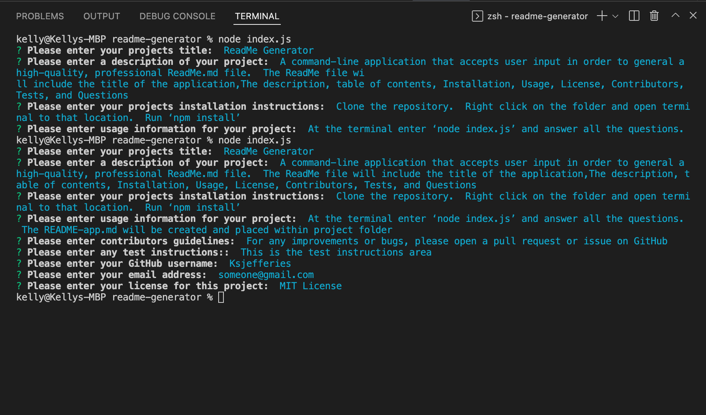

# readme-generator

## Objective:

A command-line application that accepts user input in order to general a high-quality, professional ReadMe.md file.  The ReadMe file will include the title of the application,The description, table of contents, Installation, Usage, License, Contributors, Tests, and Questions

-----
In this project, we did the following:

- User will start the application from the terminal window and entering node index.js.
- User will answer the following questions presented:
    * What is the title of your project
    * The Description of your project
    * Installation instructions
    * How to start the application
    * Contributors
    * Test Instructions
    * Enter their GitHub username
    * Enter their email
-----

## The Movie Database Images:

-----
## Links for Github Repository and The Movie Database public page:

- [Github Repository for Project-1: The Movie Database](https://github.com/ksjefferies/project-1)

- [Project-1: The Movie Database](https://ksjefferies.github.io/project-1/)

## Authors:

- [Kelly Jefferies](https://github.com/ksjefferies)
- [Matt Jackson](https://github.com/Matt4292)
- [Rohit Balachandar](https://github.com/Robala98)

## Technologies Used:

- Javascript
- HTML
- CSS
- jQuery
- BootStrap
- The Movie Db API's

## License:

This code is licensed under the MIT License